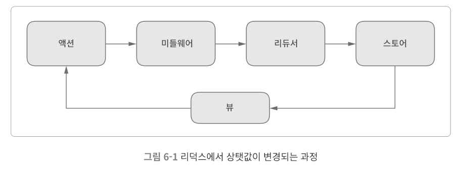

# 6-02. 리덕스의 주요 개념 이해하기

> 목차

- [1. Action](#1-action)
    - [ActionCreator](#actioncreator)
    - [ActionCreator의 비동기처리](#actioncreator의-비동기처리)
- [2. middleware](#2-middleware)
  - [미들웨어를 설정하는 방법](#미들웨어를-설정하는-방법)
  - [미들웨어와 리듀서의 실행순서](#미들웨어와-리듀서의-실행순서)
  - [`applyMiddleware()`](#applymiddleware)
  - [dispatch 메서드의 내부 구현](#dispatch-메서드의-내부-구현)



여기서 뷰는 리액트의 컴포넌트이다.
상탯값을 변경하는 과정에서 거치게 되는 리덕스의 4가지 요소는 순서대로 Action, middleware, reducer, store이다.

## 1. Action

action은 type 속성값을 가진 자바스크립트 객체를 말한다. 액션 객체를 dispatch메서드에 넣어서 호출하면, 리덕스는 미들웨어를 거쳐 reduce를 통해 상탯값을 변경한다. 액션 객체에는 type 속성값 이외에도 원하는 속성값을 원하는만큼 넣어도 된다. 각 액션은 고유한 type 속성값을 사용해야 하기 때문에 접두사를 붙이는 방법을 많이 사용한다.

```js
// action object example
store.dispatch({ type: 'ADD', title: '영화 보기', priority: 'high' });
store.dispatch({ type: 'REMOVE', id: 123 });
store.dispatch({ type: 'REMOVE_ALL' });
```

### ActionCreator

dispatch 메서드를 호출할 때 직접 액션 객체를 입력하는 방법은 사용하지 않는 것이 좋기 때문에 액션 생성자 함수를 이용해서 해결할 수 있다.

```js
function addTodo({ title, priority }) {
  return { type: 'todo/ADD', title, priority};
}

function removeTodo({ id }) {
  return { type: 'todo/REMOVE', id };
}

function removeAllTodo() {
  return { type: 'todo/REMOVE_ALL' };
}

store.dispatch(addTodo({ title: '영화보기', priority: 'high' }));
store.dispatch(removeTodo({ id: 123 }));
store.dispatch(removeAllTodo()));
```

3개의 액션 생성자 함수를 정의했다. 액션 생성자 함수를 필요한 인수와 함께 호출하면 항상 같은 구조의 액션 객체가 만들어진다. 나중에 액션 객체의 구조를 변경할 때는 액션 생성자 함수만 수정하면 된다.

dispatch 메서드를 호출할 땐 액션 생성자 함수를 이용한다. type 속성값을 reducer에서 액션 객체를 구분할 때도 사용되기 때문에 상수 변수로 만들면 좋다.

```js
export const ADD = 'todo/ADD';
export const REMOVE = 'todo/REMOVE';
export const REMOVE_ALL = 'todo/REMOVE_ALL';

function addTodo({ title, priority }) {
  return { type: 'todo/ADD', title, priority};
}

function removeTodo({ id }) {
  return { type: 'todo/REMOVE', id };
}

function removeAllTodo() {
  return { type: 'todo/REMOVE_ALL' };
}

store.dispatch(addTodo({ title: '영화보기', priority: 'high' }));
store.dispatch(removeTodo({ id: 123 }));
store.dispatch(removeAllTodo()));
```

type이름을 상수 변수로 만들었다. 이 변수는 리듀서에서도 필요하기 때문에 `export` 키워드를 사용해서 외부에 노출시킨다. 또한 액션 생성자 함수도 외부에서 호출해야 하기 때문에 외불로 노출한다.

상탯값은 순수 함수에 의해서먄 변경되어야 한다는 리덕스의 원칙에 위배되지 않기 때문에 액션 생성자 함수는 함수 외부의 변화를 주는 부수 효과를 발생시켜도 괜찮다.
예를 들어, addTodo() 액션 생성자 함수에서 새로운 할 일을 서버에 저장하기 위해 API호출을 할 수 있다. 따라서 액션 생성자 함수에서 API와 같은 비동기작업을 할 수도 있다.

### ActionCreator의 비동기처리 

(6.6)

## 2. middleware

미들웨어는 리듀서가 액션을 처리하기 전에 실행하는 함수이다.
디버깅 목적으로 상탯값을 변경할 때 로그를 출력하거나, 리듀서에서 발생한 예외를 서버로 전송하는 등의 목적으로 활용이 가능하다.

리덕스를 사용할 때 특별히 미들웨어를 설정하지 않았다면, 발생한 액션은 바로 리듀서로 보내진다.

```js
// 화살표 함수
const myMiddleware = store => next => action => next(action);

// function 키워드
const myMiddleware = function(store) {
  return function(next) {
    return function(action) {
      // 아무런 작업도 하지 않고 next함수를 호출하기 때문에 무의미한 미들웨어 함수이다.
      return next(action);
    };
  };
};
```

위처럼 미들웨어는 함수 3개가 중첩된 구조로 되어있다.
코드에서 알 수 있듯이 미들웨어는 스토어와 액션 객체를 기반으로 필요한 작업을 수행한다.

### 미들웨어를 설정하는 방법

```js
import { createStore, applyMiddleware } from 'redux';

const middleware1 = store => next => action => {
  console.log('middleware1 start');
  const result = next(action);
  console.log('middleware1 end');
  return result;
};

const middleware2 = store => next => action => {
  console.log('middleware start');
  const result = next(action);
  console.log('middleware2 end');
  return result;
};
'
// 실제로 아무런 state도 변경하지 않는 리듀서이다.
const myReducer = (state, action) => {
  console.log('myReducer');
  retunr state;
}

const store = createStore(myReducer, applyMiddleware(middleware1, middleware2));
store.dispatch({ type: 'someAction' });
```

`store.dispatch({ type: 'someAction' });` 에 의해 출력되는 콘솔로그 확인을 하면 아래와 같은 결과가 나오면서 미들웨어와 리듀서의 실행 순서를 확인할 수 있다.

```
middleware1 start
middleware2 start
myReducer
middleware2 end
middleware1 end
```

### 미들웨어와 리듀서의 실행순서

1. middleware1 미들웨어에서 호출한 next함수는 middleware2 미들웨어 함수를 실행한다.
2. middleware2 미들웨어에서 호출한 next함수는 스토어가 원래 가지고 있던 dispatch 메서드를 호출한다.
3. 최종적으로 스토어의 dispatch 메서드는 리듀서를 호출한다.

### `applyMiddleware()`

```js
const applyMiddleware = (...middlewares) => createStore => (...args) => {
  const store = createStore(...args);
  const funcsWithStore = middlewares.map(middleware => middleware(store));
  const chainedFunc = funcsWithStore.reduce(a, b) => next) => a(b(next)));
  
  return {
    ...store,
    dispatch: chainedFunc(store, dispatch),
  };
};
```

1. 입력된 createStore() 함수를 호출해서 스토어를 생성한다.

```js
const store = createStore(...args);
```

2. 생성된 스토어와 함께 모든 미들웨어의 첫 번째 함수를 호출한다.
미들웨어의 첫 번째 함수를 호출하면 next 매개변수를 가지는 두 번째 함수가 만들어진다.
funcsWithStore의 모든 함수는 클로저를 통해 store 객체에 접근이 가능하다.

```js
const funcsWithStore = middlewares.map(middleware => middleware(store));
```

> Q. 클로저??

3. 모든 미들웨어의 두 번째 함수를 체인으로 연결했다.
만약 미들웨어가 3개였다면 chainedFunc 함수는 `necy => a(b(c(next)))` 와 같다.

```js
const chainedFunc = funcsWithStore.reduce(a, b) => next) => a(b(next)));
```

4. 외부에 노출되는 스토어의 dispatch 메서드는 미들웨어가 적용된 버전으로 변경된다.
만약 미들웨어가 2개였다면 `a(b(store.dispatch))` 와 같다.
따라서 사용자가 dispatch 메서드를 호출하면 첫 번째 미들웨어 함수부터 실행된다.
그리고 마지막 미들웨어가 store.dispatch 메서드를 호출한다.

```js
return {
  ...store,
  dispatch: chainedFunc(store, dispatch),
};
```

### dispatch 메서드의 내부 구현

```js
function dispatch(action) {
  currentState = currentReducer(currentState, action);
  for (let i = 0; i < listeners.length; i++) {
    listeners[i]();
  }
  return action;
}
```

1. 리듀서 함수를 호출해서 상탯값을 변경한다.

2. dispatch 메서드가 호출될 때마다 등록된 모든 이벤트 처리 함수를 호출한다.
상탯값이 변경되지 않아도 이벤트 처리 함수를 호출하는 것이 중요하다.
상탯값 변경을 검사하는 코드는 각 이벤터 처리 함수에서 구현해야 한다.


